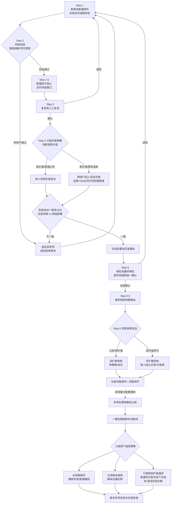

# GM 全服邮件配置中台

> 高保真交互原型 | 米哈游/科幻基建风运营后台
> 
> **在线体验：** https://yunzhixu620-stack.github.io/gm-mail-platform/

---

## 一、业务背景与核心痛点

本项目源于一次真实的**10000 钻石误发事故**复盘。事故根因并非简单的"员工误操作"，而是三个系统性漏洞同时成立：

1. **视觉与操作无区隔：** 高价值货币与低价值货币在 UI 上无视觉区分 → 极易填错。
2. **缺乏硬性流程约束：** 单人操作即可跑完全流程 → 没有拦截机制。
3. **测试与正式环境脱节：** 发送前无真实环境验证 → 测试服通过不代表正式服配置无误。

因此，本方案对症下药，兼顾**极端的安全性**与**日常运营的敏捷性**。

---

## 二、完整闭环流程图（Mermaid）

---

## 三、核心三大痛点与解决方案

### 痛点一：逆向还原技术落地难

**问题：** 客服要求"无损追回"，但程序侧深知抽卡逆向还原极易引发保底错乱、概率链断裂等连环灾难。

**方案：三级分级止损 + "资产负债"追回机制（F3）**
- **Level 1（未领取）：** 一键全服阻断 + 模板失效撤回。
- **Level 2（已领取未使用）：** 脚本批量扣除道具。
- **Level 3（已使用高价值道具）：** **放弃逆向还原**，改为行业成熟的**负债表机制**（如星琼直接扣至负数），确保技术可平稳落地，不破坏抽卡概率链。

---

### 痛点二：全量双人灰度拖累效率

**问题：** 所有邮件都走双人灰度，日常公告/低价值补偿也要等 QA 排期，运营效率极低。

**方案：高价值写扩散 + 低价值读扩散分层架构（F2）**
- **低价值/公告类：** 走**读扩散**（单模板广播，服务器低压），支持单人快速灰度。
- **高价值货币/限定道具：** 走**写扩散**（每人独立记录，全链路可追溯），强制跨部门双人双盲灰度。
- **服务端硬校验兜底：** 即使前端被绕过，后端发送服务在"拆包验货"时识别到高价值 item_id，强制路由入写扩散表并触发告警。

---

### 痛点三：LLM 过度干预可能引发误判

**问题：** AI 自动监听社区舆情并自动发补偿邮件，可能因玩家玩梗、节奏帖而误判，导致过度发奖。

**方案：LLM 辅助舆情监听 + "草稿箱"预警（F6）**
- LLM 实时监测社区负面指数（如炸服）。
- 指数超标时，**系统自动生成补偿邮件草稿并钉钉/飞书强提醒负责人**。
- **但不自动发送**——保留人类的最终决策权（Human-in-the-loop），防止 AI 因社区玩梗而误判发奖。

---

## 四、前端原型核心交互亮点

本仓库的 `index.html` 是一个可直接运行的**高保真交互原型**，完整还原了上述方案中的核心防呆设计：

| 功能 | 实现细节 |
|------|---------|
| **货币类型视觉强隔离** | 选择"星琼/专票"时，输入框切换为橙色警示边框，与信用点的蓝色形成绝对反差 |
| **抽卡价值实时换算** | 高价值资产下方实时显示 `Math.floor(quantity / 160)` 抽，形成心理威慑 |
| **阶梯式动态熔断** | `≤1000` 安全区 / `1001-2000` 预警区（强制 Checkbox 确认）/ `>2000` 熔断区（全屏红光闪烁 + 按钮锁定）|
| **双屏 Diff 比对** | 提交前弹出 Git Diff 式左右分屏（移动端上下堆叠），差异项强制 RadioGroup 点选"确认无误"或"退回修改" |
| **退回修改阻断流程** | 只要有一个差异项选"退回修改"，底部按钮立即变红并关闭 Modal，**不可强制提交** |
| **响应式适配** | Mobile-First 设计：侧边栏抽屉、表单单列堆叠、提交按钮吸底 + `env(safe-area-inset-bottom)` |

---

## 五、AI 协同工作流说明

本方案在构思、设计与前端落地阶段，深度接入了生成式 AI 工具进行工作流辅助与逻辑推演，**绝非纯手搓或纯抄袭**：

### 1. 需求降噪与矛盾聚焦
利用大语言模型的信息提取能力，将题目中四个业务部门（客服、程序、公关、QA）的复杂建议进行冲突分析。快速锁定了"读扩散不可追回"与"无损追回诉求"之间的底层系统矛盾，为分层架构（F2）和负债表机制（F3）的提出提供了逻辑支撑。

### 2. Red Teaming（红蓝对抗）测试
在漏洞挖掘阶段，设定 Prompt 让大模型扮演"极度疲惫的新手运营"与"具有破坏倾向的内部测试员"，对拟定的审核流程进行模拟攻击。"时间差并发篡改"（200ms 网络延迟窗口抓包重发）及"QA 盲目点击确认"漏洞，均是在与 AI 的多轮对抗推演中发现并闭环的。

### 3. UI 交互可视化辅助
核心防错交互中的"数值熔断状态机"、"双屏 Diff 比对逻辑"，通过将业务要求转化为前端约束指令（如 `zone === 'fuse' ? 'ring-red-500' : zone === 'warning' ? 'ring-amber-500' : 'ring-blue-400'`），由 AI 辅助生成了逻辑自洽的高保真交互原型。人类负责定义业务规则与视觉规范，AI 负责代码实现与响应式适配，形成高效的人机协同闭环。

---

## 六、在线部署指南

### 方案一：Netlify Drop（最快，无需注册）

1. 打开 https://app.netlify.com/drop
2. 将本文件夹内的 `index.html` 直接**拖拽**到网页中
3. 立刻获得一个 `xxx.netlify.app` 的在线网址

### 方案二：GitHub Pages（推荐，长期稳定）

本仓库已启用 GitHub Pages，直接访问：

**👉 https://yunzhixu620-stack.github.io/gm-mail-platform/**

### 方案三：Vercel（国内访问较快）

1. 打开 https://vercel.com/new
2. 导入本 GitHub 仓库
3. 直接 Deploy，无需任何配置

---

## 七、技术栈

- React 18 (Production CDN)
- Tailwind CSS CDN
- Framer Motion
- 内联 Lucide SVG 图标（零外部图标依赖）
- Mobile-First 响应式（`md:` / `lg:` 断点）

## 八、本地预览

直接在浏览器中打开 `index.html` 即可，无需构建步骤。
